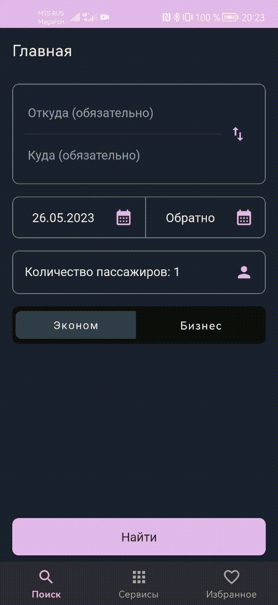
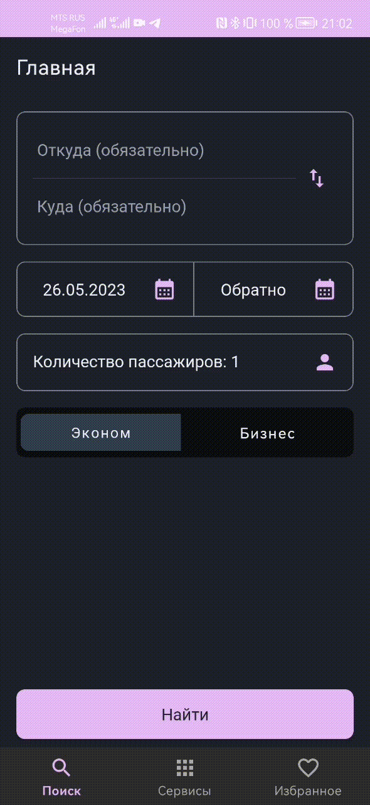

# Учебный проект в университете - BaluAirlines

BaluAirlines - это приложение авиакомпании в котором вы сможете купить билет на самолет, а также посмотреть различную информацию о перелетах по России.

## Функционал
* Полный flow покупки авиабилета;
* Табло рейсов;
* Статус рейса;
* Информация о бронировании;
* Избранные бронирования;

### flow Покупки авиабилета:
* Поиск билета по параметрам: аэропорт вылета, аэропорт прилета, дата вылета, класс обслуживания, количество пассажиров;
* Возможность просмотра минимальных цен на 7 дней вперед;
* Возможность просмотра перелетов на следующий день (до 7 дней вперед);
* Возможность просмотреть детальную информацию о перелете;
* Возможность выбрать понравившийся билет и купить его для этого необходимо внести необходимые данные;
* Купленный билет автоматически добавится в раздел избранные бронирования;

### Табло рейсов 
Возможность просмотреть рейсы из аэропорта на выбранный день

### Статус рейса
Возможность просмотреть информацию о рейсе и его статус по следующим параметрам: 
* По маршруту и дате;
* По номеру рейса и дате;

 

### Просмотр статуса бронирования
Возможность просмотреть информацию и статус бронирования по его номеру

### Стек технологий: 
* Retrofit для запросов к бэкенду, который разрабатывал одногруппник https://github.com/ivasnev/BaluAirlines
* Room для локального хранения избранных бронирований;
* Dagger2 для предоставления зависимостей;
* Naviagtion components для навигации;
* Coroutines для работы в многопоточности;
* Плагин Dokka для генерации страницы с документацией проекта;  
